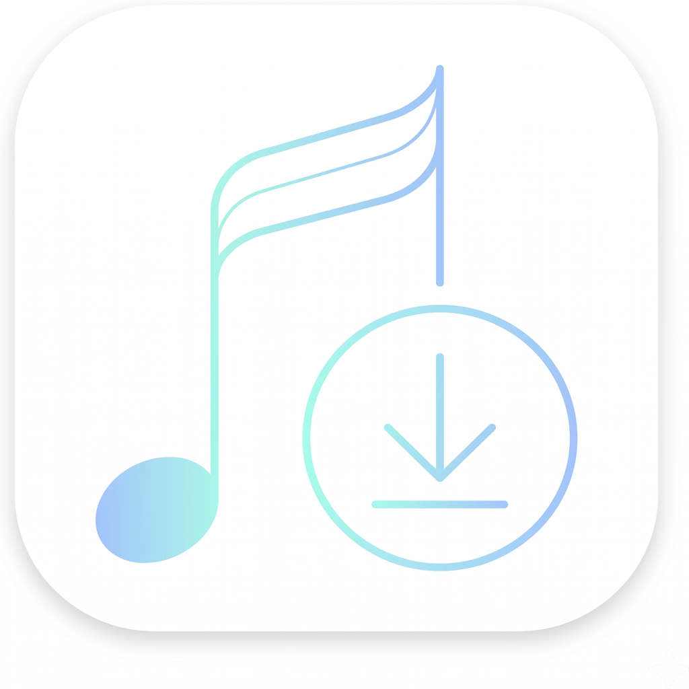
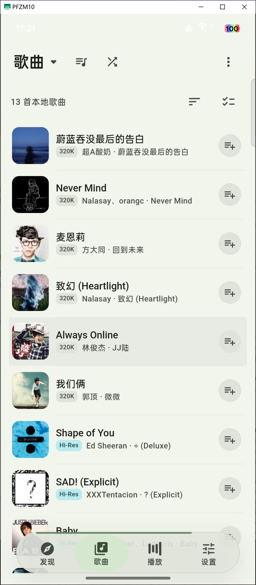
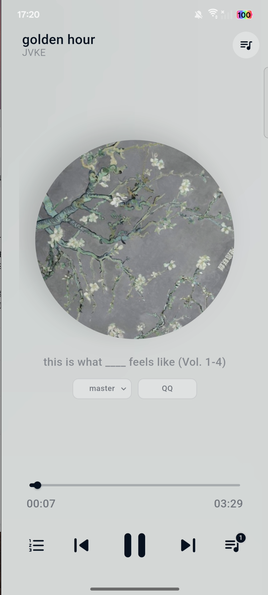
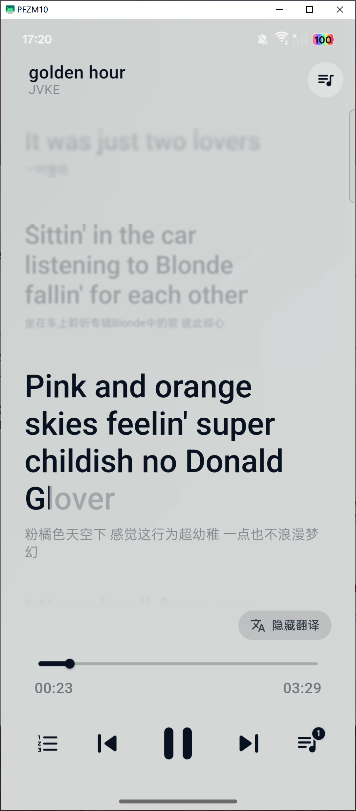
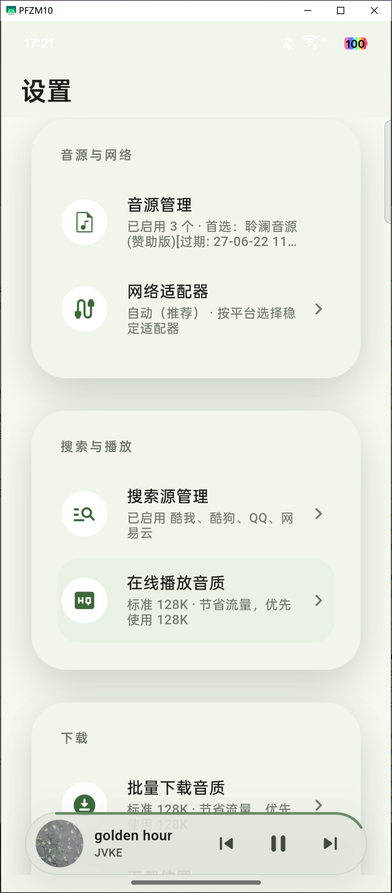
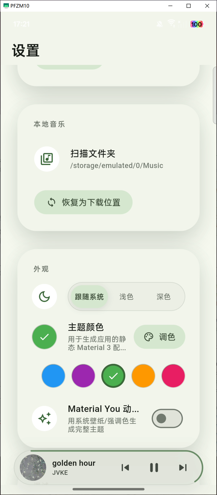
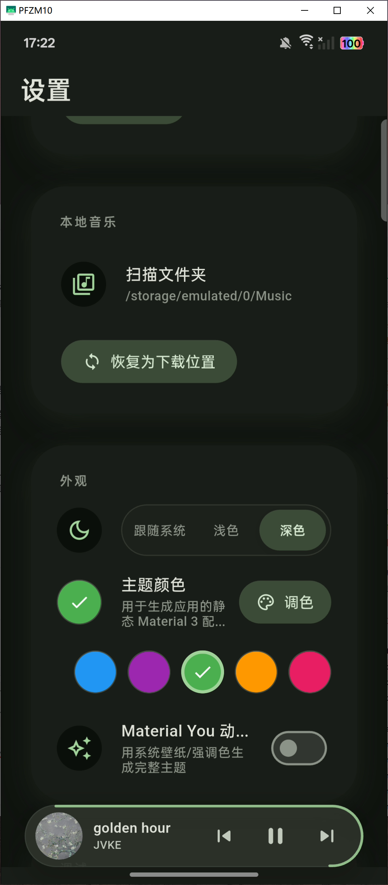
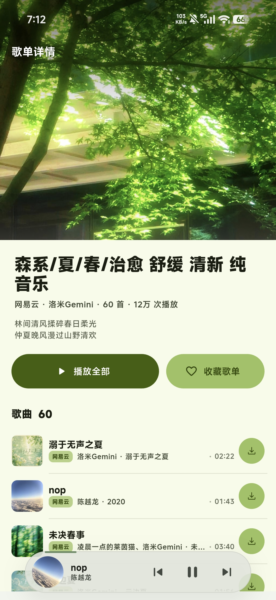

<div align="center">
  
  <h1>CyShineMusic</h1>
  <p>栖弦 - 面向 Android 的自定义源音乐播放器</p>
  <p>
    <a href="https://github.com/KevinllBin/CyShineMusic"><strong>项目主页</strong></a>
    ·
    <a href="https://github.com/KevinllBin/CyShineMusic/issues">问题反馈</a>
  </p>
  <p>
    <a href="./LICENSE"></a>
  </p>
</div>

## 项目简介

CyShineMusic 是一个使用 Flutter 构建的 Android 音乐客户端，提供自定义源管理、音乐检索、下载管理、本地歌曲库和播放器能力。项目重点放在移动端体验、本地媒体整理、歌词展示和 Material 3 界面。

项目不内置或分发任何音乐内容。用户需要自行配置可用的自定义源，并自行确认相关内容来源的合法性。

## 功能特性

- **自定义源**：支持导入、启用、禁用和管理自定义音乐源。
- **音乐检索**：提供关键词搜索、来源筛选和搜索结果分页。
- **下载管理**：支持下载队列、实时进度、完成记录和失败记录。
- **本地歌曲库**：扫描自定义目录，读取本地音频标签，并支持排序、搜索、选择和批量操作。
- **元数据整理**：支持写入歌曲名、歌手、专辑、封面和歌词。
- **歌词体验**：支持逐句歌词、逐字歌词、翻译/音译展示和播放同步。
- **本地播放器**：支持在线播放、本地播放、后台播放、系统媒体通知和耳机按键控制。
- **播放队列**：支持上一首、下一首、随机、循环和播放队列管理。
- **主题外观**：支持浅色、深色、跟随系统、动态取色和自定义主题色。
- **调试工具**：提供应用内日志和基础网络设置，方便定位自定义源或下载问题。

## 截图

<table>
  <tr>
    <td align="center"><br>发现</td>
    <td align="center"><br>歌单详情</td>
    <td align="center"><br>本地歌曲</td>
  </tr>
  <tr>
    <td align="center"><br>播放器</td>
    <td align="center"><br>逐字歌词</td>
    <td align="center"><br>设置</td>
  </tr>
  <tr>
    <td align="center"><br>浅色外观</td>
    <td align="center"><br>深色外观</td>
    <td align="center"><br>在线歌单</td>
  </tr>
</table>

## 开发环境

- Flutter stable，Dart SDK `>=3.11.4 <4.0.0`
- Android SDK
- Android 真机或模拟器

```powershell
flutter pub get
flutter analyze
flutter test
flutter run
```

仅构建 `arm64-v8a` 发布包：

```powershell
flutter build apk --target-platform=android-arm64
```

构建产物位于：

```text
build/app/outputs/flutter-apk/app-release.apk
```


## 项目结构

```text
lib/
├── main.dart                    # 应用入口与依赖初始化
├── app.dart                     # MaterialApp、主题与全局状态
├── router.dart                  # 页面路由
├── core/
│   ├── api/                     # 网络客户端与通用请求封装
│   ├── models/                  # 音乐、歌词、音质与响应模型
│   ├── music_sources/           # 自定义源管理与运行时
│   ├── sdk/                     # 源适配与解析辅助
│   ├── services/                # 下载、标签、歌词、权限与日志
│   ├── storage/                 # 设置与本地持久化
│   └── ui/                      # 通用 UI 组件
├── features/
│   ├── search/                  # 搜索、来源筛选与音质选择
│   ├── downloads/               # 下载队列与历史记录
│   ├── songs/                   # 本地歌曲库
│   ├── player/                  # 播放器与歌词同步
│   ├── music_sources/           # 自定义源导入与管理
│   ├── playlists/               # 歌单与收藏管理
│   ├── settings/                # 下载、网络和外观设置
│   ├── shell/                   # 应用导航框架
│   └── startup/                 # 启动页
└── theme/                       # Material 3 主题与动效
```

## 贡献

欢迎通过 [Issues](https://github.com/KevinllBin/CyShineMusic/issues) 提交问题或建议，也可以直接发起 Pull Request。提交前请至少运行：

```powershell
flutter analyze
flutter test
```

## 友情链接

- [Linux.do 社区](https://linux.do/)

## 许可证

本项目基于 [MIT License](./LICENSE) 开源。

## 免责声明

本项目仅用于技术研究与学习交流，不提供任何音乐内容，不保证任何自定义源的可用性。使用者应遵守所在地区法律法规、第三方服务条款及著作权要求，并自行承担使用本项目产生的责任。
